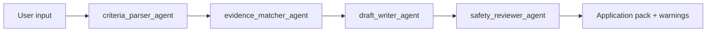

# ADK Workflow Notes

GroundedApply uses a live ADK multi-agent workflow in `agents/root_agent.py`.

## Runtime Implementation

The current runtime uses an ADK `SequentialAgent` because this application has a fixed, auditable order:

1. Criteria Parser
2. Evidence Matcher
3. Draft Writer
4. Safety Reviewer

This is equivalent to a simple graph with one straight-line path:

The workflow intentionally avoids autonomous branching because job-application drafting needs traceability and human review more than open-ended exploration.

## ADK 2.0 Course Alignment

The newer ADK lifecycle codelab emphasizes graph-style `Workflow` design, typed state and deployment lifecycle commands. GroundedApply aligns with that pattern conceptually:

| ADK lifecycle concept | GroundedApply implementation |
|---|---|
| Agent graph | Straight-line four-agent workflow |
| Nodes | Four ADK `LlmAgent` sub-agents |
| Edges | The `SequentialAgent` order |
| State | Criteria, evidence matches, draft answers and security review |
| Tools | Python tool functions and MCP wrappers |
| Evaluation | Deterministic tests under `tests/` plus manual live ADK trace review |
| Deployment | Streamlit, Dockerfile and optional Cloud Run command |

If the installed ADK package exposes the newer graph `Workflow` APIs, the same node order can be migrated without changing the domain tools. The current version keeps the proven live path stable for Kaggle review.

## How To Prove The Live Path

1. Set `GOOGLE_API_KEY`.
2. Run `python -m streamlit run app.py`.
3. Select `Live ADK/Gemini`.
4. Build a pack.
5. Open the `ADK trace` tab and show events from the ADK runner.

The deterministic fallback is not a replacement for ADK. It exists so tests, notebook review and offline demos still work without credentials.
